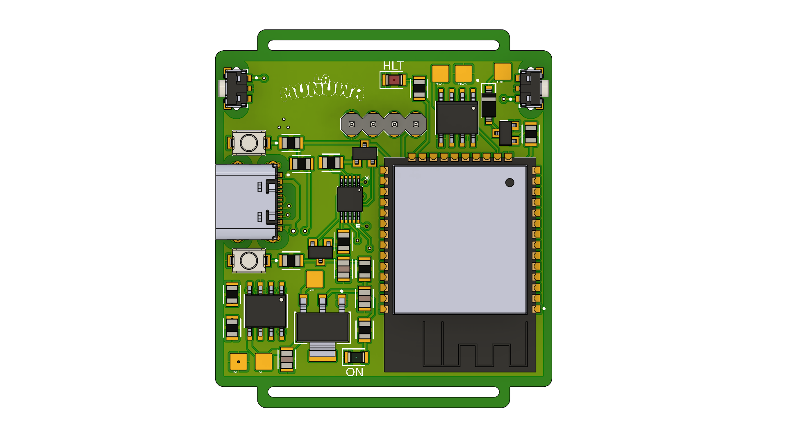

# ExpWatch (DIY SmartWatch)

**ExpWatch** (Experimental Watch) is an open-source, production-ready ESP32-based wearable platform created to explore compact electronics, embedded firmware, and power-optimization challenges.

Rather than becoming a commercial product, ExpWatch exists as a engineering learning platform and a portfolio project demonstrating full-stack hardware and firmware integration.

> Current status: **v1.0.0 [RELEASED] - Hardware validated & Production files ready.**

## Key Features

* **Hardware:** A simple I2C bus was used to ensure the stability of all sensors and actuators, and a clean routing scheme was implemented to prevent problems.
* **Asynchronous Firmware:** Built on PlatformIO, leveraging non-blocking execution clocks (`millis()`) instead of generic delays.
* **Power Management:** Automatic transition to `ESP32 Light Sleep` after 15 seconds of inactivity, reducing current consumption.
* **Biomedical Sensor:** Real-time heart rate and SpO2 tracking via the `MAX30100` sensor.

## Hardware Architecture

| Component | Model | Description |
| :--- | :--- | :--- |
| **MCU** | ESP32-WROOM-32 | Dual-core Wi-Fi/BT micro-controller |
| **Pulse Sensor** | MAX30100 | Integrated pulse oximeter and heart-rate sensor |
| **RTC** | DS3231MZ+ | Highly accurate I2C Real-Time Clock |
| **Display** | SSD1306 OLED | 128×64 pixels monochrome screen |
| **USB-UART** | CH340X | On-board flashing and debugging interface |
| **Battery Charger** | TP4056 | Li-Ion battery charger with status LEDs |
| **Voltage Regulator**| AMS1117-3.3V | LDO linear voltage regulator |
| **Battery** | 3.7V Li-Po 200mAh | Ultra-compact wearable power supply |
| **Haptic Feedback** | Coin Vibration Motor| Tactile alarm notification system via GPIO |

## Repository Structure

```text
├── docs/                     # Project reference materials
│   ├── datasheets/           # Component technical documentation
│   └── images/               # Images (PCB.png, IRL.jpeg)
├── fabrication/              # Production-ready files (Gerbers, BOM, Pick&Place)
├── firmware/
│   └── src/                  # Only main.cpp code
│   └── platformio/           # Complete VS Code + PlatformIO IDE workspace
├── hardware/
│   ├── exports/              # Schematic and Layout PDFs & 3D.pdf views
│   ├── layout/               # Autodesk Fusion 360 PCB Layout (.fbrd)
│   └── schematic/            # Autodesk Fusion 360 Schematic (.fsch)
├── CHANGELOG.md              # Semantic versioning historical log
└── README.md
```

## Acknowledgments
ExpWatch is a personal portfolio project, but community ideas, forks, and pull requests are highly encouraged! If you have any suggestions regarding hardware improvements or firmware power optimizations, feel free to open an issue. <3
